# Documentación Proyecto 1 Laboratorio de Redes de Computadoras 1
## Brando Iván Muñoz Debroy
### 201700890

## Capturas de topología
### Completa
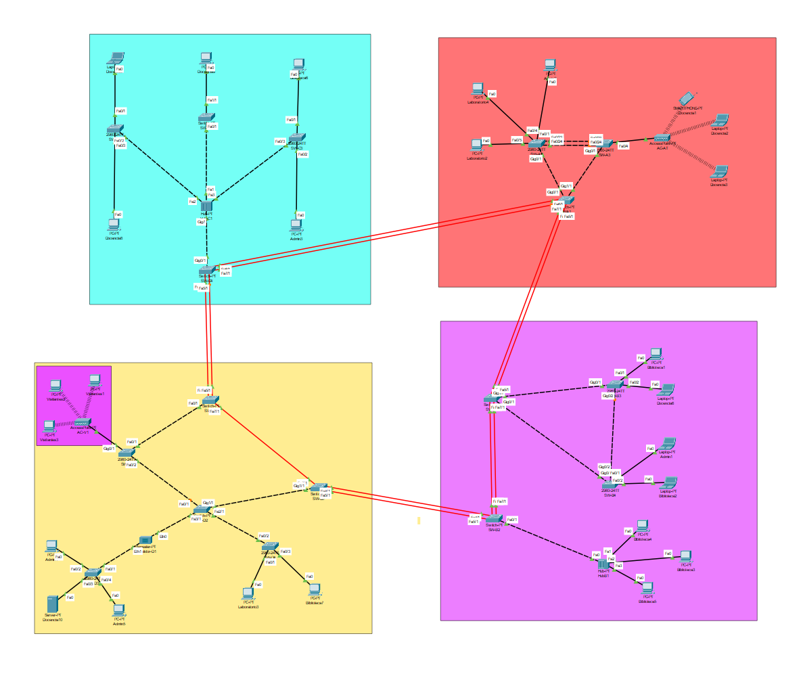
### Por edificios
#### Edificio A
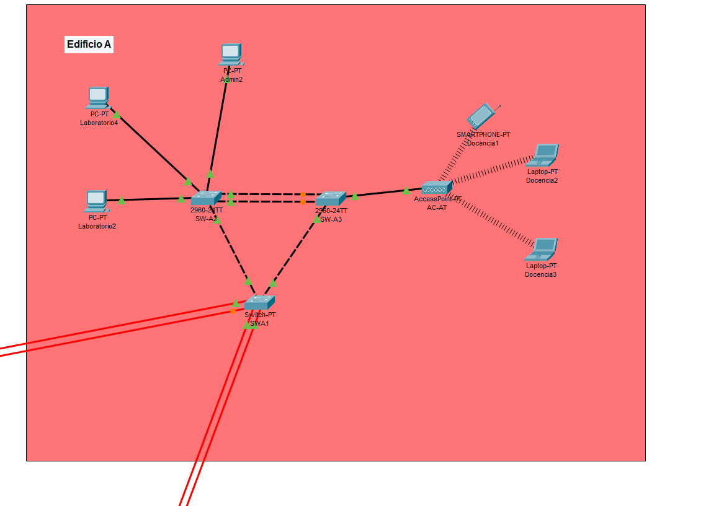
#### Edificio B
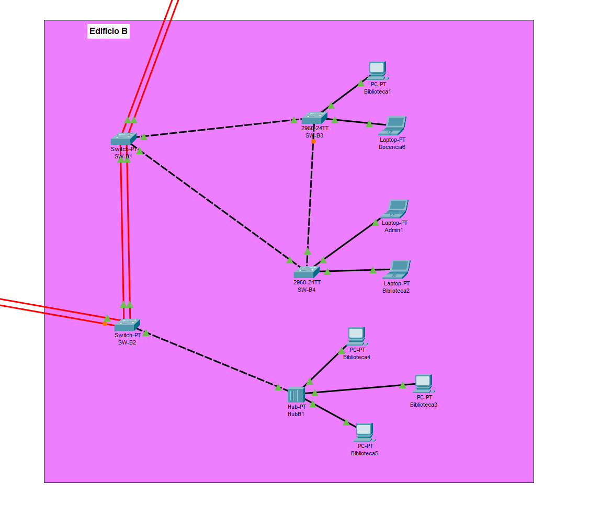
#### Edificio C

#### Edificio D
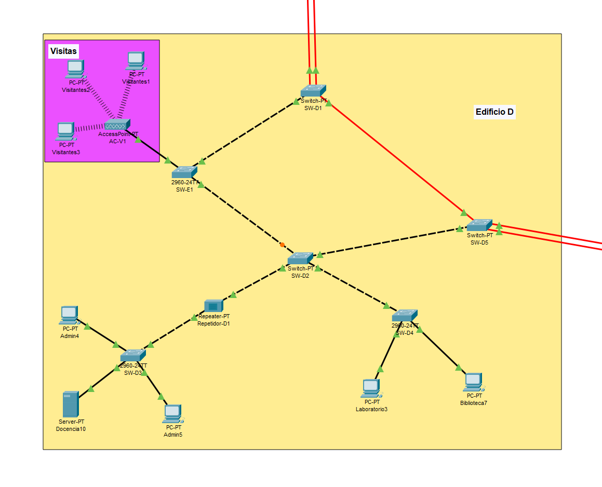

### Con etiquetas
#### Edificio A
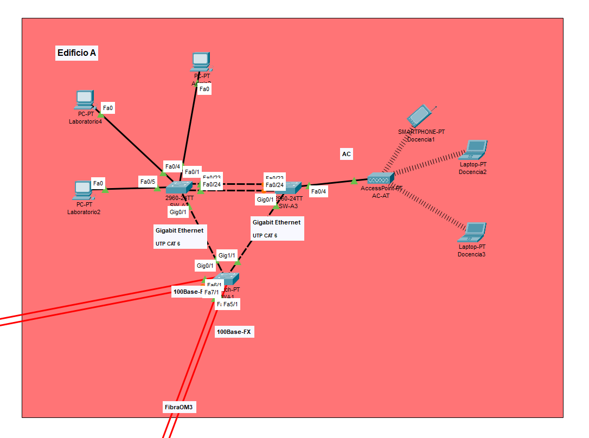
#### Edificio B
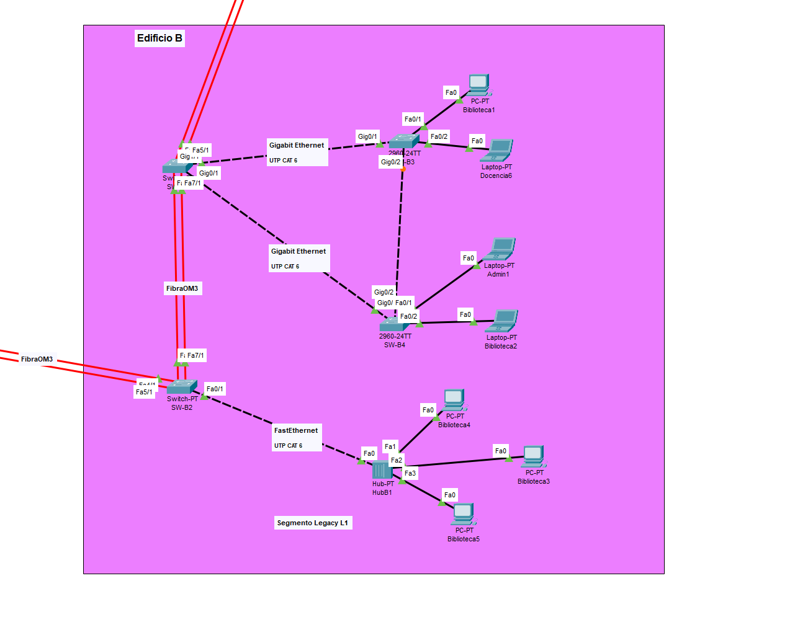
#### Edificio C
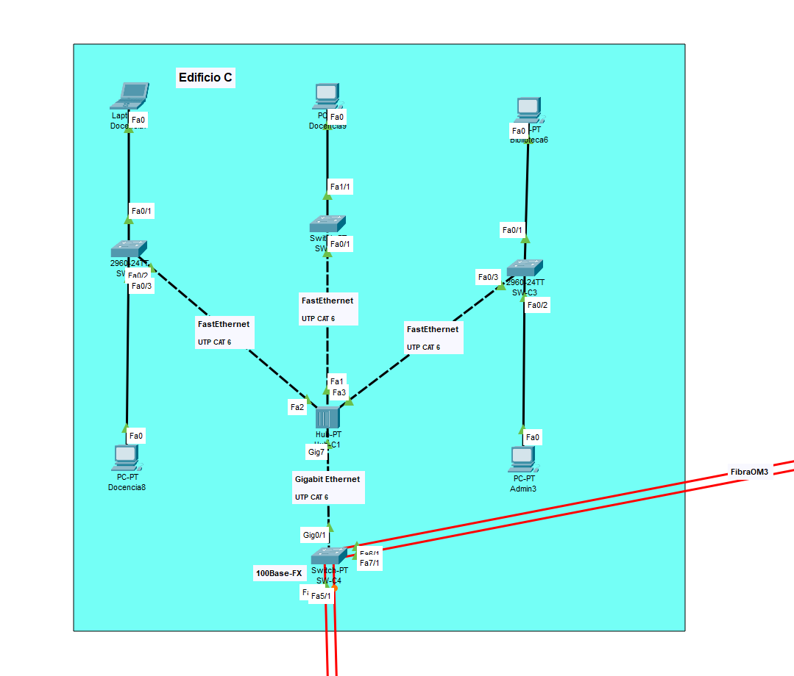
#### Edificio D
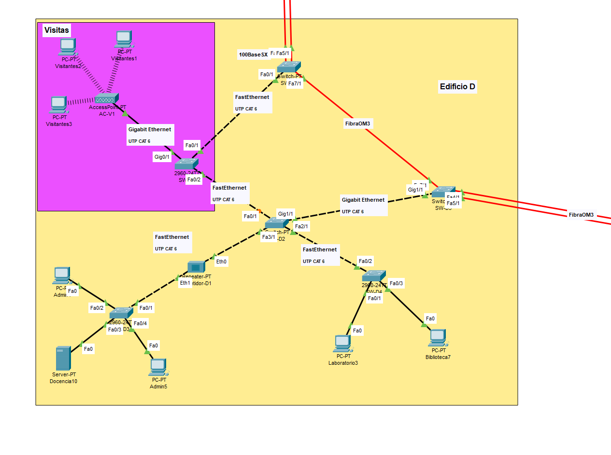

## Tablas de dominio

| Área         | Cantidad de dominios de colisión | Cuáles                                                                                                                                                                                                                                                                                                                                              |
| ------------ | -------------------------------: | --------------------------------------------------------------------------------------------------------------------------------------------------------------------------------------------------------------------------------------------------------------------------------------------------------------------------------------------------- |
| Edificio A   |                                7 | 1) SW-A1↔SW-A2, 2) SW-A1↔SW-A3, 3) Port-Channel A2↔A3 enlace 1, 4) Port-Channel A2↔A3 enlace 2, 5) PC Admin2↔switch, 6) PC Laboratorio2↔switch, 7) Segmento SW-A3↔AC-A1↔Docencia1/Docencia2/Docencia3                                                                                                                                               |
| Edificio B   |                               10 | 1) Port-Channel B1↔B2 enlace 1, 2) Port-Channel B1↔B2 enlace 2, 3) SW-B1↔SW-B3, 4) SW-B1↔SW-B4, 5) Admin1↔switch, 6) Biblioteca1↔switch, 7) Biblioteca2↔switch, 8) Docencia6↔switch, 9) Segmento legacy SW-B2↔Hub-B1↔Biblioteca3/Biblioteca4/Biblioteca5, 10) enlace B1↔A1 o B2↔D5 según backbone del campus                                        |
| Edificio C   |                                2 | 1) Backbone SW-C4↔campus, 2) Segmento compartido SW-C4↔Hub-C1↔SW-C1/SW-C2/SW-C3↔Admin3/Docencia7/Docencia8/Docencia9/Biblioteca6/Biblioteca7                                                                                                                                                                                                        |
| Edificio D   |                               10 | 1) Port-Channel D1↔C4 enlace 1, 2) Port-Channel D1↔C4 enlace 2, 3) enlace D1↔D5, 4) Port-Channel D5↔B2 enlace 1, 5) Port-Channel D5↔B2 enlace 2, 6) SW-D5↔SW-D2, 7) Segmento SW-D2↔Repeater-D1↔SW-D3↔Laboratorio3/Docencia10/Servidor, 8) SW-D2↔SW-D4 con Admin4/Admin5, 9) SW-D1↔SW-E1, 10) SW-D2↔SW-E1↔AC-D1↔Visitantes1/Visitantes2/Visitantes3  |
| Total campus |                               29 | Suma de los dominios de colisión por edificio, considerando que los hubs y el repetidor crean medios compartidos y que cada enlace de switch/port-channel cuenta como dominio independiente en capa 2                                                                                                                                               |

### De colision por área
### De broadcast

 
## Lista de Comandos usados

### Edificio A

### SW-A1
1) en
1) conf ter
1) hostname SW-A1
1) no ip domain-lookup
1) enable secret class
1) service password-encryption
1) vtp password proyecto12026
1) banner motd #Bienvenido a Edificio A - NETCORE_201700890#
1) spanning-tree mode pvst
1) vtp version 2
1) vtp mode server
1) vtp domain C9_NetCore
1) write memory
#### Troncales
1) interface g0/1
1) description TRUNK_A_SW-A2
1) switchport mode trunk
1) switchport trunk allowed vlan 10,20,30,40,50
1) interface g1/1
1) description TRUNK_A_SW-A3
1) switchport mode trunk
1) switchport trunk allowed vlan 10,20,30,40,50
#### PORTCHANNEL - B
1) interface range fa4/1, fa5/1
1) description PORTCHANNEL_TO_SW-B1
1) switchport mode trunk
1) switchport trunk allowed vlan 10,20,30,40,50
1) channel-group 5 mode active
1) interface port-channel 5
1) description Po5_TO_SW-B1
1) switchport mode trunk
1) switchport trunk allowed vlan 10,20,30,40,50
#### PORTCHANNEL - C
1) interface range fa6/1, fa7/1
1) description PORTCHANNEL_TO_SW-C4
1) switchport mode trunk
1) switchport trunk allowed vlan 10,20,30,40,50
1) channel-group 4 mode active
1) interface port-channel 4
1) description Po4_TO_SW-C4
1) switchport mode trunk
1) switchport trunk allowed vlan 10,20,30,40,50

### SW-A2
1) en
1) conf ter
1) hostname SW-A2
1) no ip domain-lookup
1) enable secret class
1) service password-encryption
1) vtp password proyecto12026
1) spanning-tree mode pvst
1) vtp version 2
1) vtp mode client
1) vtp domain C9_NetCore
1) write memory
#### Troncales
1) interface g0/1
1) description TRUNK_TO_SW-A1
1) switchport mode trunk
1) switchport trunk allowed vlan 10,20,30,40,50
#### PORTCHANNEL
1) interface range fa0/23 - 24
1) description PORTCHANNEL_TO_SW-A3
1) switchport mode trunk
1) switchport trunk allowed vlan 10,20,30,40,50
1) channel-group 1 mode desirable
1) interface port-channel 1
1) description Po1_TO_SW-A3
1) switchport mode trunk
1) switchport trunk allowed vlan 10,20,30,40,50
#### Configuracion de puertos VLAN
##### Admin2
1) interface fa0/1
1) description Admin2
1) switchport mode access
1) switchport access vlan 10
1) spanning-tree portfast
1) no shutdown
##### Laboratorio2
1) interface fa0/5
1) description Laboratorio2
1) switchport mode access
1) switchport access vlan 40
1) spanning-tree portfast
1) no shutdown
##### Laboratorio4
1) write memory
1) interface fa0/4
1) description Laboratorio4
1) switchport mode access
1) switchport access vlan 40
1) spanning-tree portfast
1) no shutdown
1) write memory

#### SW-A3
1) en
1) conf ter
1) hostname SW-A2
1) no ip domain-lookup
1) enable secret class
1) service password-encryption
1) vtp password proyecto12026
1) spanning-tree mode pvst
1) vtp version 2
1) vtp mode client
1) vtp domain C9_NetCore
1) write memory
#### Troncales
1) interface g0/1
1) description TRUNK_TO_SW-A1
1) switchport mode trunk
1) switchport trunk allowed vlan 10,20,30,40,50
#### PORTCHANNEL - A2
1) interface range fa5/1, fa4,1
1) description PORTCHANNEL_TO_SW-A2
1) switchport mode trunk
1) switchport trunk allowed vlan 10,20,30,40,50
1) channel-group 1 mode desirable
1) interface port-channel 1
1) description Po1_TO_SW-A2
1) switchport mode trunk
1) switchport trunk allowed vlan 10,20,30,40,50
#### Configuracion de puertos VLAN
##### Admin2
1) interface fa0/4
1) description Docencia1-3
1) switchport mode access
1) switchport access vlan 20
1) spanning-tree portfast
1) no shutdown

### Edificio B
### SW_B1
1) en
1) conf ter
1) hostname SW-B1
1) no ip domain-lookup
1) enable secret class
1) service password-encryption
1) vtp password proyecto12026
1) banner motd #Bienvenido a Edificio B - NETCORE_201700890#
1) spanning-tree mode pvst
1) vtp version 2
1) vtp mode client
1) vtp domain C9_NetCore
1) write memory
#### Troncales
1) interface g0/1
1) description TRUNK_A_SW-B3
1) switchport mode trunk
1) switchport trunk allowed vlan 10,20,30,40,50
1) interface g1/1
1) description TRUNK_A_SW-B4
1) switchport mode trunk
1) switchport trunk allowed vlan 10,20,30,40,50
#### PORTCHANNEL - A
1) interface fa4/1
1) description LINK_TO_SW-A1_1
1) switchport mode trunk
1) switchport trunk allowed vlan 10,20,30,40,50
1) channel-group 5 mode active
1) interface fa5/1
1) description LINK_TO_SW-A1_2
1) switchport mode trunk
1) switchport trunk allowed vlan 10,20,30,40,50
1) channel-group 5 mode active
1) interface port-channel 5
1) description Po5_TO_SW-A1
1) switchport mode trunk
1) switchport trunk allowed vlan 10,20,30,40,50
#### PORTCHANNEL - B2 (INTRA)
1) interface range fa6/1,fa7/1
1) description PORTCHANNEL_TO_SW-B2
1) switchport mode trunk
1) switchport trunk allowed vlan 10,20,30,40,50
1) channel-group 1 mode desirable
1) interface port-channel 1
1) description Po1_TO_SW-B2
1) switchport mode trunk
1) switchport trunk allowed vlan 10,20,30,40,50

### SW_B2
1) en
1) conf ter
1) hostname SW-B2
1) no ip domain-lookup
1) enable secret class
1) service password-encryption
1) vtp password proyecto12026
1) spanning-tree mode pvst
1) vtp version 2
1) vtp mode client
1) vtp domain C9_NetCore
1) write memory
#### PORTCHANNEL B1
1) interface range fa6/1, fa7/1
1) description LINK_TO_SW-B1
1) switchport mode trunk
1) switchport trunk allowed vlan 10,20,30,40,50
1) channel-group 1 mode active
1) interface port-channel 1
1) description Po1_TO_SW-B1
1) switchport mode trunk
1) switchport trunk allowed vlan 10,20,30,40,50
#### PORTCHANNEL
1) interface range fa4/1, fa5/1
1) description LINK_TO_SW-D5
1) switchport mode trunk
1) switchport trunk allowed vlan 10,20,30,40,50
1) channel-group 5 mode active
1) interface port-channel 5
1) description Po5_TO_SW-D5
1) switchport mode trunk
1) switchport trunk allowed vlan 10,20,30,40,50
#### Configuracion de puertos VLAN
1) interface fa0/1
1) description HUB-B1
1) switchport mode access
1) switchport access vlan 30
1) spanning-tree portfast

### SW_B3
1) en
1) conf ter
1) hostname SW-B3
1) no ip domain-lookup
1) enable secret class
1) service password-encryption
1) vtp password proyecto12026
1) spanning-tree mode pvst
1) vtp version 2
1) vtp mode client
1) vtp domain C9_NetCore
1) write memory
##### Troncales
1) interface g0/1
1) description TRUNK_TO_SW-B1
1) switchport mode trunk
1) switchport trunk allowed vlan 10,20,30,40,50
##### Biblioteca1
1) interface fa0/1
1) description Biblioteca1
1) switchport mode access
1) switchport access vlan 30
1) spanning-tree portfast
1) no shutdown
##### Docencia6
1) interface fa0/2
1) description Docencia6
1) switchport mode access
1) switchport access vlan 20
1) spanning-tree portfast
1) no shutdown

### SW_B4
1) en
1) conf ter
1) hostname SW-B4
1) no ip domain-lookup
1) enable secret class
1) service password-encryption
1) vtp password proyecto12026
1) spanning-tree mode pvst
1) vtp version 2
1) vtp mode client
1) vtp domain C9_NetCore
1) write memory
##### Troncales
1) interface g0/1
1) description TRUNK_TO_SW-B1
1) switchport mode trunk
1) switchport trunk allowed vlan 10,20,30,40,50
##### Admin1
1) interface fa0/1
1) description Admin1
1) switchport mode access
1) switchport access vlan 10
1) spanning-tree portfast
1) no shutdown
##### Biblioteca2
1) interface fa0/2
1) description Biblioteca2
1) switchport mode access
1) switchport access vlan 30
1) spanning-tree portfast
1) no shutdown

#### SW_D5
1) en
1) conf ter
1) hostname SW-D5
1) no ip domain-lookup
1) enable secret class
1) service password-encryption
1) vtp password proyecto12026
1) banner motd #Bienvenido a Edificio D - NETCORE_201700890#
1) spanning-tree mode pvst
1) vtp version 2
1) vtp mode client
1) vtp domain C9_NetCore
1) write memory
#### PORTCHANNEL B2
1) interface range fa4/1, fa5/1
1) description LINK_TO_SW-B2
1) switchport mode trunk
1) switchport trunk allowed vlan 10,20,30,40,50
1) channel-group 5 mode active
1) interface port-channel 5
1) description Po5_TO_SW-B2
1) switchport mode trunk
1) switchport trunk allowed vlan 10,20,30,40,50
##### Troncales
1) interface g1/1
1) description TRUNK_TO_SW-D2
1) switchport mode trunk
1) switchport trunk allowed vlan 10,20,30,40,50

#### SW_D1
1) en
1) conf ter
1) hostname SW-D1
1) no ip domain-lookup
1) enable secret class
1) service password-encryption
1) vtp password proyecto12026
1) spanning-tree mode pvst
1) vtp version 2
1) vtp mode client
1) vtp domain C9_NetCore
1) write memory
#### PORTCHANNEL C4
1) interface range fa4/1, fa5/1
1) description LINK_TO_SW-C4
1) switchport mode trunk
1) switchport trunk allowed vlan 10,20,30,40,50
1) channel-group 5 mode active
1) interface port-channel 5
1) description Po5_TO_SW-C4
1) switchport mode trunk
1) switchport trunk allowed vlan 10,20,30,40,50
##### Troncales
1) interface fa0/1
1) description TRUNK_TO_SW-E1
1) switchport mode trunk
1) switchport trunk allowed vlan 10,20,30,40,50

#### SW_E1
1) en
1) conf ter
1) hostname SW-E1
1) no ip domain-lookup
1) enable secret class
1) service password-encryption
1) vtp password proyecto12026
1) spanning-tree mode pvst
1) vtp version 2
1) vtp mode transparent
1) vtp domain C9_NetCore
1) write memory

#### SW_C4
1) en
1) conf ter
1) hostname SW-C4
1) no ip domain-lookup
1) vtp version 2
1) vtp mode client
1) vtp domain C9_NetCore
1) enable secret class
1) service password-encryption
1) vtp password proyecto12026
1) spanning-tree mode pvst
1) write memory
#### PORTCHANNEL D1
1) interface range fa4/1, fa5/1
1) description LINK_TO_SW-D1
1) switchport mode trunk
1) switchport trunk allowed vlan 10,20,30,40,50
1) channel-group 5 mode active
1) interface port-channel 5
1) description Po5_TO_SW-D1
1) switchport mode trunk
1) switchport trunk allowed vlan 10,20,30,40,50
#### PORTCHANNEL A1
1) interface range fa6/1, fa7/1
1) description LINK_TO_SW-A1
1) switchport mode trunk
1) switchport trunk allowed vlan 10,20,30,40,50
1) channel-group 4 mode active
1) interface port-channel 4
1) description Po4_TO_SW-A1
1) switchport mode trunk
1) switchport trunk allowed vlan 10,20,30,40,50
##### Troncales
1) interface g0/1
1) description TRUNK_TO_HUB-C1
1) switchport mode trunk
1) switchport trunk allowed vlan 10,20,30,40,50

### Comandos para verificar cambios en todos

show vlan brief
show vtp status
show spanning-tree
show interfaces trunk
show etherchannel summary
vtp password proyecto12026
Password para mientras es: class

## Tabla de IPs

| Edificio| Tipo |Nombre| IP|
|---|---|---|---|
|B|Laptop|Admin1|192.168.10.1|
|A|PC|Admin2|192.168.10.2|
|C|PC|Admin3|192.168.10.3|
|D|PC|Admin4|192.168.10.4|
|D|PC|Admin5|192.168.10.5|
|A|PC|Laboratorio2|192.168.10.12|
|D|PC|Laboratorio3|192.168.10.13|
|A|PC|Laboratorio4|192.168.10.14|
|A|Smartphone|Docencia1|192.168.10.21|
|A|Laptop|Docencia2|192.168.10.22|
|A|Laptop|Docencia3|192.168.10.23|
|B|Laptop|Docencia6|192.168.10.26|
|C|Laptop|Docencia7|192.168.10.27|
|C|PC|Docencia8|192.168.10.28|
|C|PC|Docencia9|192.168.10.29|
|D|Servidor|Docencia10|192.168.10.30|
|B|PC|Biblioteca1|192.168.10.31|
|B|Laptop|Biblioteca2|192.168.10.32|
|B|PC|Biblioteca3|192.168.10.33|
|B|PC|Biblioteca4|192.168.10.34|
|B|PC|Biblioteca5|192.168.10.35|
|C|PC|Biblioteca6|192.168.10.36|
|C|PC|Biblioteca7|192.168.10.37|
|E|PC|Visitantes1|192.168.10.41|
|E|PC|Visitantes2|192.168.10.42|
|E|PC|Visitantes3|192.168.10.43|

## Tabla de VLANS
|Nombre| Rango de IPs| VLAN ID|Dispositivos|
|---|--------|--------|---|
|Administración|192.168.10.1-10|10|Admin1, Admin2, Admin3, Admin4, Admin5|
|Docencia|192.168.10.21-30|20|Docencia1, Docencia2, Docencia3, Docencia6, Docencia7, Docencia8, Docencia9, Docencia10|
|Biblioteca|192.168.10.31-40|30|Biblioteca1, Biblioteca2, Biblioteca3, Biblioteca4, Biblioteca5, Biblioteca6, Biblioteca7|
|Laboratorio|192.168.10.11-20|40|Laboratorio2, Laboratorio3, Laboratorio4|
|Visitante|192.168.10.41-50|50|Visitantes1, Visitantes2, Visitantes3|
## Capturas de ejemplos

### Pruebas de PING
### Fallidos
#### Admin
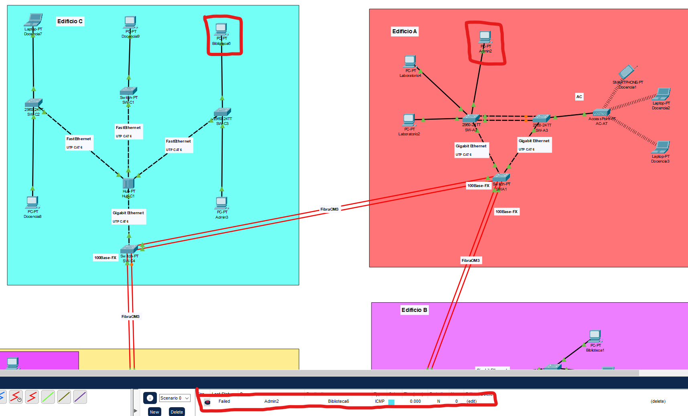
#### Docencia
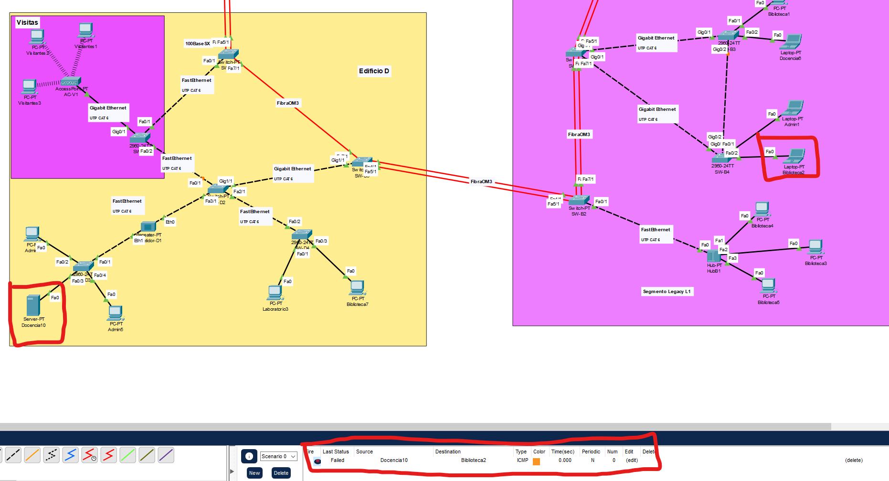
#### Laboratorio
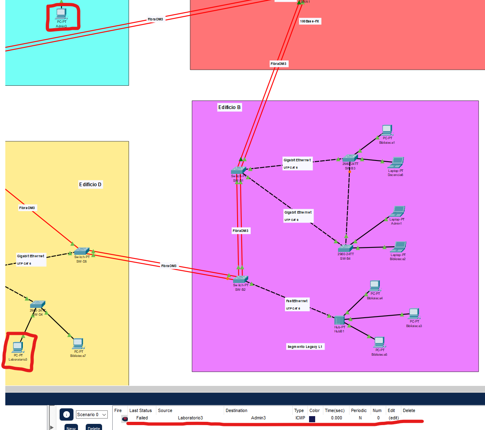
#### Biblioteca
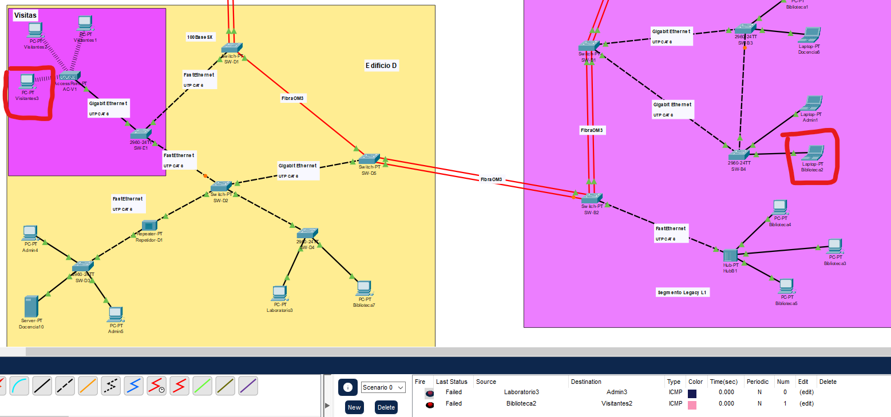
#### Visitantes
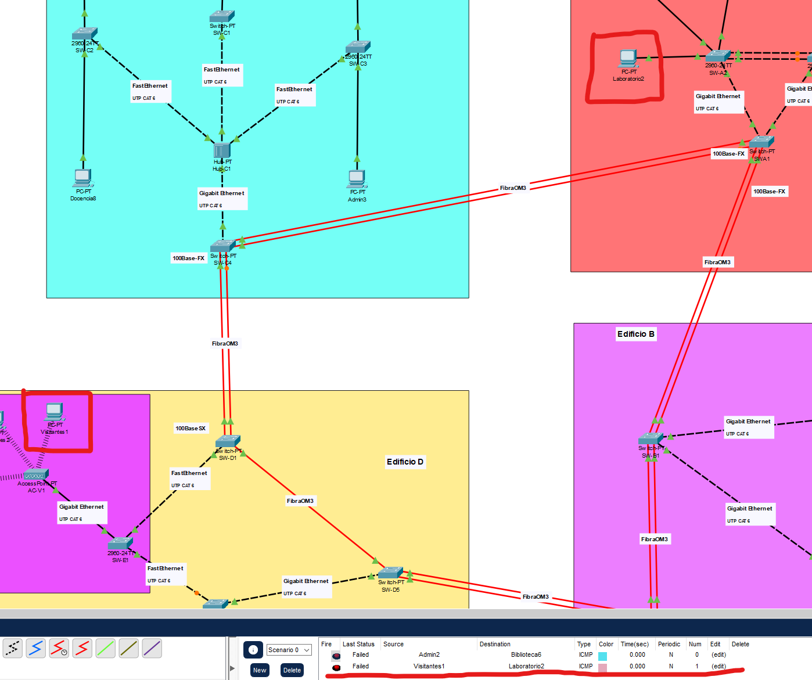
### Exitosos
#### Admin
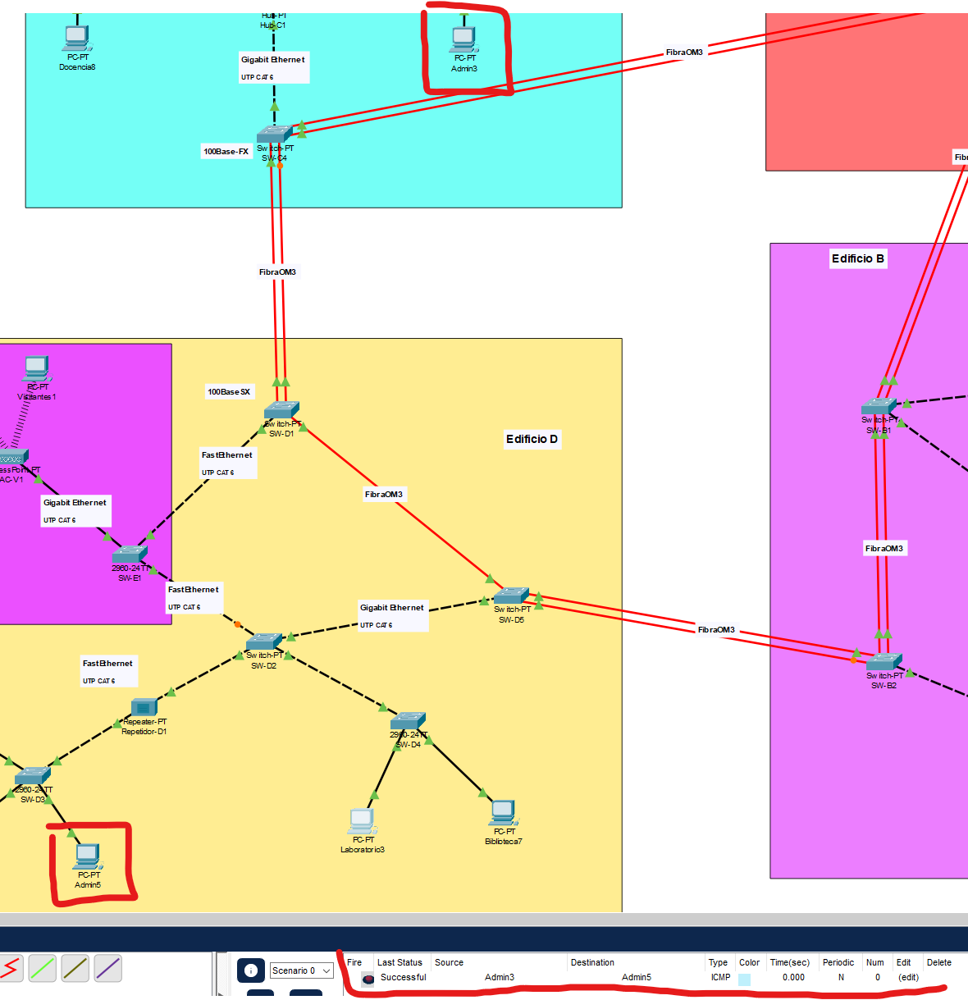
#### Docencia
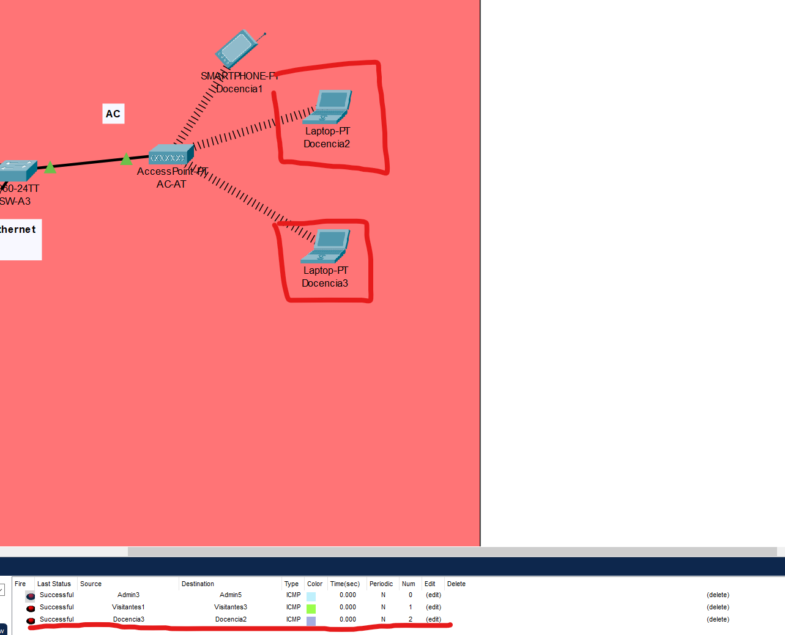
#### Laboratorio
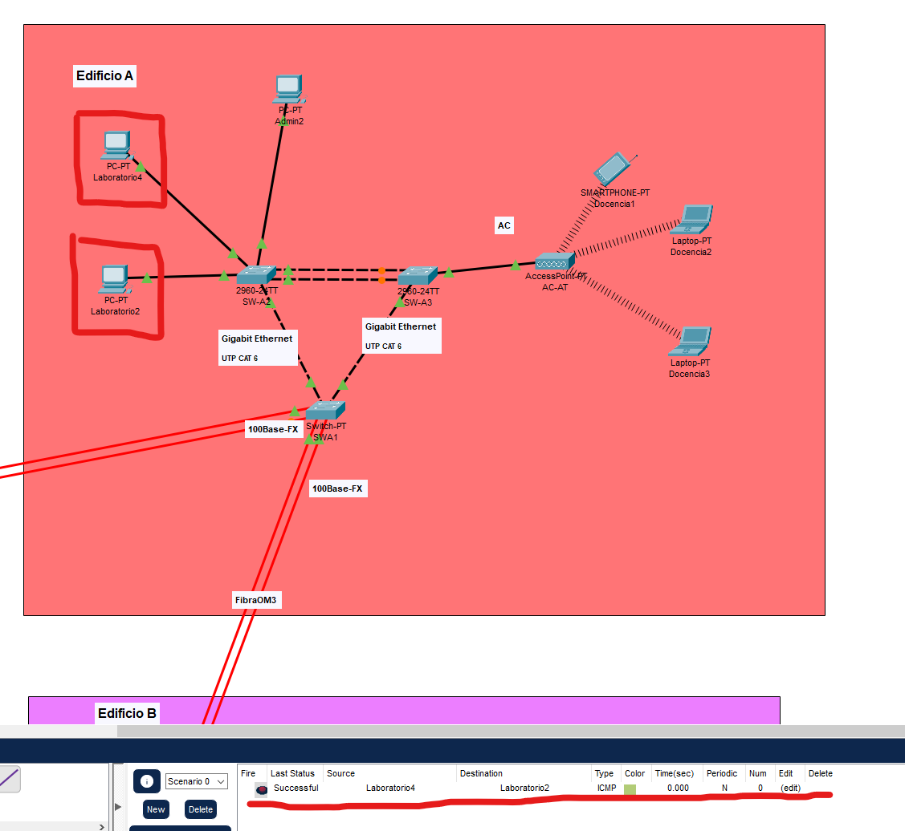
#### Biblioteca
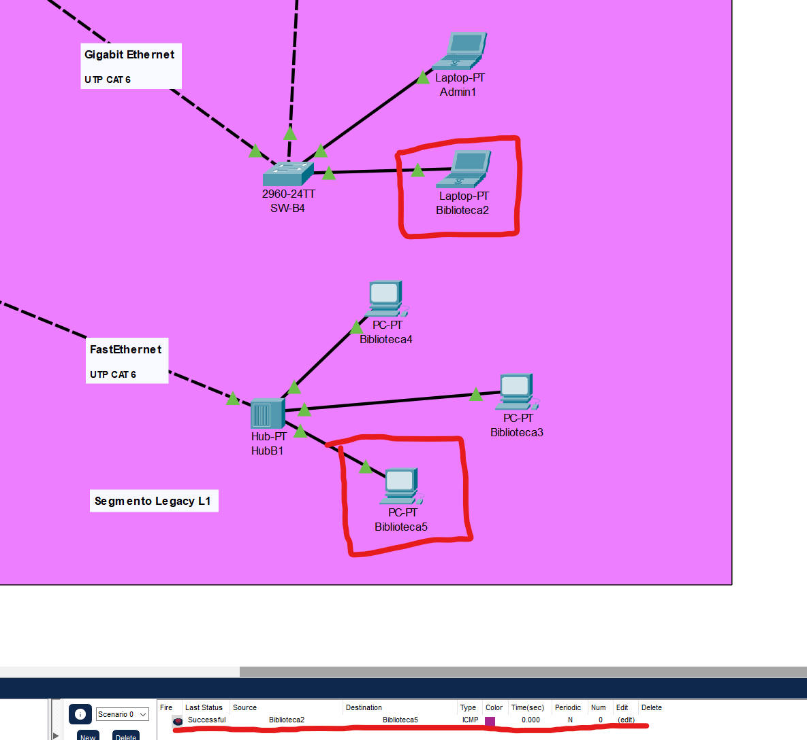
#### Visitantes
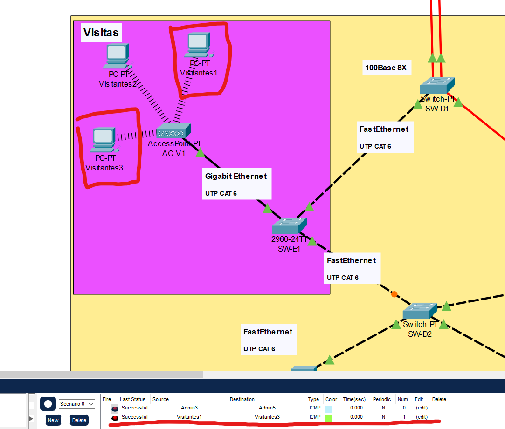

### Spanning-Tree

### Ethernet Channel

### Interfaces

## Presupuesto
### Listas de componentes

| Componente                            | Cantidad |
| ------------------------------------- | -------: |
| Switch Cisco 2960-24TT                |       14 |
| Switch-PT / switch backbone con fibra |        3 |
| Módulo de fibra PT-SWITCH-NM-1FFE     |       22 |
| Access Point                          |        2 |
| Hub-PT                                |        2 |
| Repeater-PT                           |        1 |
| Cable de consola USB-RJ45             |        1 |
| PCs                                   |       18 |
| Laptops                               |        6 |
| Smartphone                            |        1 |
| Servidor                              |        1 |

| Componente                       | Cantidad | Precio unitario estimado | Subtotal |
| -------------------------------- | -------: | -----------------------: | -------: |
| Switch Cisco 2960-24TT           |       14 |                   Q1,200 |  Q16,800 |
| Switch-PT / equivalente backbone |        3 |                   Q1,600 |   Q4,800 |
| Módulo PT-SWITCH-NM-1FFE         |       22 |                     Q150 |   Q3,300 |
| Access Point básico              |        2 |                     Q350 |     Q700 |
| Hub-PT / hub básico              |        2 |                     Q150 |     Q300 |
| Repeater básico                  |        1 |                     Q100 |     Q100 |
| Cable UTP Cat5e/6 (caja)         |        2 |                     Q900 |   Q1,800 |
| Patch cords / cableado UTP extra |   1 lote |                     Q600 |     Q600 |
| Tramos de fibra OM3              |       11 |                     Q250 |   Q2,750 |
| Conectores / patch fibra         |       22 |                      Q25 |     Q550 |
| Cable de consola USB-RJ45        |        1 |                      Q80 |      Q80 |

#### Total : Q31,780.00~